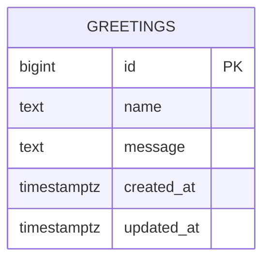

# Database Design (ERD) — Hello World

Engine: PostgreSQL 16
Last updated: 2026-09-03
Source requirements: `docs/hello/SRS.md`

## 1. Overview

This schema stores public greeting submissions for the Hello World demo. The only aggregate root is `greetings`; health checks and computed hello messages remain stateless and out of the database.

No accounts, sessions, permissions, payments, files, or third-party records are stored.

## 2. Diagram

Cardinality: none. `greetings` has no relationships because SRS defines no users, owners, or parent records.

## 3. Entities

### 3.1 `greetings`

**Purpose** — Store one guest-submitted greeting and return it in newest-first order. **Traces to** — HELLO-003, HELLO-004, HELLO-005.

| Column | Type | Null | Default | Unique | Description |
|---|---|---|---|---|---|
| `id` | `bigint generated always as identity` | no | identity sequence | PK | Surrogate row id returned by POST and GET greetings |
| `name` | `text` | no | none | no | Guest name; trimmed application input; must be non-empty and short |
| `message` | `text` | no | none | no | Greeting message; trimmed application input; must be non-empty and short |
| `created_at` | `timestamptz` | no | `now()` | no | Creation time returned by API and used for newest-first ordering |
| `updated_at` | `timestamptz` | no | `now()` | no | Last update time; same as `created_at` for this append-only table |

**Nullable columns** — none.

**Foreign keys**

| Column | References | On delete | On update | Why |
|---|---|---|---|---|
| none | none | n/a | n/a | SRS defines no parent entity or ownership relationship |

**Constraints**

- Primary key: `pk_greetings` on `id`.
- `ck_greetings_name_not_blank`: `length(btrim(name)) > 0` enforces non-empty names at database boundary.
- `ck_greetings_name_short`: `length(name) <= 80` enforces reasonably short names matching visible form-limit intent.
- `ck_greetings_message_not_blank`: `length(btrim(message)) > 0` enforces non-empty messages at database boundary.
- `ck_greetings_message_short`: `length(message) <= 240` enforces reasonably short messages matching visible form-limit intent.

**Indexes**

| Name | Columns | Type | Query it serves |
|---|---|---|---|
| `idx_greetings_created_at_id` | `created_at DESC, id DESC` | btree | `GET /api/greetings` reads stored greetings newest first with deterministic tie-break |

**Lifecycle** — hard delete only via future administrative maintenance or migration. Product has no delete endpoint, no retention workflow, and no audit/reporting requirement that would justify soft delete.

## 4. Enumerations

No enumerations. SRS defines no finite status or type fields.

## 5. Access patterns

| # | Pattern | Frequency | Index used |
|---|---|---|---|
| 1 | Insert one greeting from `POST /api/greetings` and return `id`, `name`, `message`, `created_at` | Per submit | Primary key generated by identity; no lookup index needed |
| 2 | List greetings for `GET /api/greetings` ordered by `created_at DESC, id DESC` | Page load and after submit | `idx_greetings_created_at_id` |
| 3 | Health check and hello message reads | Frequent | No table access; stateless endpoints |

## 6. Data volume and growth

| Table | Rows at launch | Growth | Retention |
|---|---|---|---|
| `greetings` | 0 | Low demo traffic; expected under 1,000/month | Retain until manual cleanup or environment reset |

No table is expected to approach 10M rows within one year. No partitioning or archival needed.

## 7. Integrity, privacy, and security

- Database enforces required fields, non-blank text, max lengths, primary key uniqueness, and newest-first access support.
- Application must trim input, validate request JSON, return field-specific validation errors, and avoid partial writes on invalid input.
- Personal data: `name` may contain visitor-provided personal data; `message` may contain visitor-provided personal data; `created_at` is submission metadata. Retention is same as greeting lifecycle because product exists to show submitted greetings publicly.
- Secrets: none stored.
- Row-level access: none. SRS says any guest can create and read greetings; no ownership or roles exist.

## 8. Migrations

| # | Change | Forward | Backward | Safe on non-empty table |
|---|---|---|---|---|
| 1 | Initial greetings schema | `001_create_greetings.up.sql`: create `greetings` table with identity PK, required text columns, timestamps, checks, and `idx_greetings_created_at_id` | `001_create_greetings.down.sql`: drop `greetings` table | Forward: yes, creates new table. Backward: destructive if rows exist; acceptable only for rollback before production data matters or after backup/export |

Implementation note: enable no extension for this table because `bigint generated always as identity` needs none.

## 9. Story extension — Persist greetings

Persist greetings adds no new database entity or column beyond the existing `greetings` table. This story is the table's primary write/read use case: `POST /v1/greetings` inserts one validated row, and `GET /v1/greetings` reads rows newest first.

**Reviewed UI mock contract** — `code/frontend/lib/mock/persist-greetings.ts` exposes `Greeting` with `id`, `name`, `message`, and `created_at`; `saveGreeting(input)` returns one stored greeting; `fetchGreetings()` returns `{ greetings: Greeting[] }`. Backend uses the same greeting fields. Difference: backend returns database ids as strings rather than mock ids like `g_...`, and list response may include pagination metadata per service contract.

**Migration plan for this story** — existing migration `001_create_greetings` already creates every required column, constraint, and index. No new migration.

| Change | Forward | Backward | Safe on non-empty table |
|---|---|---|---|
| Persist greetings API data needs | No database change; use existing `greetings` table, constraints, and `idx_greetings_created_at_id` | No database change | Yes; no schema or data mutation |

## 10. Story extension — Hello page

Hello page adds no new database entity or column. It reads `GET /v1/hello`, creates rows through `POST /v1/greetings`, and refreshes the list through `GET /v1/greetings`.

**Reviewed UI mock contract** — `code/frontend/lib/mock/hello-api.ts` exposes `Greeting` with `id`, `name`, `message`, and `created_at`; `getHello()` returns `{ "message": "Hello, World!" }`; `createGreeting()` returns one stored greeting; `getGreetings()` returns newest-first greetings. Backend uses same fields. Difference: backend encodes `id` as string and wraps list results in `{ greetings, next_cursor, has_more }` per existing service pagination contract; frontend adapter must map this envelope when mock is replaced.

**Migration plan for this story** — no new migration. Existing migration `001_create_greetings` already creates every column and index needed by the Hello page.

| Change | Forward | Backward | Safe on non-empty table |
|---|---|---|---|
| Hello page data needs | No database change | No database change | Yes; no schema or data mutation |

## 10. Story extension — Hello API

Hello API adds no database entity, column, relationship, constraint, or index. `GET /v1/health` and `GET /v1/hello` are stateless reads and do not touch PostgreSQL.

**Reviewed UI mock contract** — `code/frontend/lib/mock/hello-api.ts` exposes `getHello(name = "")` returning `{ message: "Hello, <name-or-World>!" }`. Backend uses same response field and defaulting rule for `GET /v1/hello`. Health has no mock field because UI only displays derived status.

**Migration plan for this story** — no migration.

| Change | Forward | Backward | Safe on non-empty table |
|---|---|---|---|
| Hello API stateless endpoints | No database change | No database change | Yes; no schema or data mutation |

## 11. Open questions

| Question | Owner | Blocking |
|---|---|---|
| none | n/a | no |
