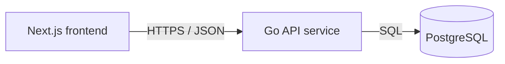

# Service & Interface Design — Hello World

Last updated: 2026-09-03
Source: `docs/hello/SRS.md`, `docs/architecture/erd.md`

## 1. Service map



| Service | Responsibility | Owns (tables) | Depends on | Deploy unit |
|---|---|---|---|---|
| Go API service | Public hello API, greeting validation, greeting persistence, database reads | `greetings` | PostgreSQL | `code/backend` container |
| Next.js frontend | Browser UI that calls API and renders hello, form, errors, stored greetings | none | Go API service | `code/frontend` container |

**Why these boundaries** — single backend service: no additional API boundary justified yet. Frontend and backend are separate deploy units because browser UI and server persistence have different runtimes. Database is owned through Go API only; frontend never reads tables directly.

## 2. Cross-cutting contract

### 2.1 Base

- External base URL: `{scheme}://{host}/api/v1`.
- Backend route base after deploy proxy strips `/api`: `/v1`.
- Endpoint paths in this document are backend routes and intentionally omit `/api`.
- Content type: `application/json; charset=utf-8` for every JSON request and response.
- Versioning: URL path major version. New major version only for breaking changes.
- Trace header: `X-Request-Id` accepted from caller, generated if absent, echoed on every response, and present in every backend request log line.

### 2.2 Authentication and authorization

| Aspect | Decision |
|---|---|
| Mechanism | none |
| Token lifetime | n/a |
| Refresh | n/a |
| Transport | no `Authorization` header required or read |
| Roles | none; public guest access only |
| Enforcement point | route handlers allow public access; no auth middleware |

### 2.3 Error contract

Every non-2xx response, from every endpoint except `GET /v1/health`, has this shape:

```json
{
  "error": {
    "code": "VALIDATION_FAILED",
    "message": "Human-readable summary, safe to show a user.",
    "details": [
      { "field": "name", "code": "REQUIRED", "message": "Name is required." }
    ],
    "request_id": "01HX..."
  }
}
```

Consumers branch on `code`. `message` is display text and may be reworded without notice. `details` is present for field validation failures and omitted or empty otherwise. Error responses never include SQL, stack traces, file paths, internal hostnames, or raw request bodies.

`GET /v1/health` returns only `{"status":"ok"}` on success. If service cannot serve, infrastructure may return a non-contract 5xx because SRS requires success body to contain health status only.

**Error catalog** — full closed set for this project.

| Code | HTTP | Meaning | Retryable |
|---|---|---|---|
| `BAD_REQUEST` | 400 | Malformed JSON, unsupported content type, or wrong field type | no |
| `VALIDATION_FAILED` | 422 | Well-formed request failed semantic validation | no |
| `INTERNAL` | 500 | Unexpected failure; details logged by `request_id`, not returned | yes |
| `UNAVAILABLE` | 503 | PostgreSQL unavailable, service starting, or service shutting down | yes |

### 2.4 Pagination

Greeting list uses cursor pagination because `greetings` grows and can be written concurrently. Default UI may omit cursor and receives newest greetings first.

```text
GET /v1/greetings?limit=20&cursor=eyJjcmVhdGVkX2F0IjoiMjAyNi0wOS0wM1QxMjowMDowMFoiLCJpZCI6IjQyIn0
```

```json
{
  "greetings": [
    { "id": "42", "name": "Ada", "message": "First greeting", "created_at": "2026-09-03T12:00:00Z" }
  ],
  "next_cursor": null,
  "has_more": false
}
```

| Aspect | Decision |
|---|---|
| Style | cursor |
| Default limit | 20 |
| Max limit | 100 |
| Default sort | `created_at DESC, id DESC`; stable unique tie-breaker uses `id` |

Cursor is opaque base64url-encoded JSON containing `created_at` RFC 3339 UTC and `id` string. Invalid cursor returns `VALIDATION_FAILED`.

### 2.5 Validation boundary

Validation boundary is Go HTTP handler request decoding layer in `code/backend`. It validates method, content type, JSON syntax, field types, string trimming, length, query parameters, limit, and cursor before calling storage code. Storage code may trust handler-validated inputs. PostgreSQL constraints remain final integrity guard.

### 2.6 Idempotency

`POST /v1/greetings` does not accept `Idempotency-Key`. Each valid POST creates one row. If client retries after timeout, duplicate rows are possible and acceptable for this demo because no external side effect, billing, or user account exists.

### 2.7 Cross-service calls

| Caller | Callee | Mode | Timeout | Retry | Idempotency key | On failure |
|---|---|---|---|---|---|---|
| Next.js frontend | Go API service | synchronous HTTP JSON | 2s per request | one retry for `GET /v1/hello`, `GET /v1/health`, and `GET /v1/greetings`; no retry for `POST /v1/greetings` | none | Show friendly API unreachable error and keep form data in browser state |
| Go API service | PostgreSQL | synchronous SQL | 2s per query | no automatic retry | n/a | Return `UNAVAILABLE` 503 for dependency outage; return `INTERNAL` 500 for unexpected database errors |

## 3. Endpoints

### 3.1 `GET /v1/health`

**Purpose** — confirm public API is reachable. **Traces to** — HELLO-001, HELLO-005. **Auth** — public.

**Path / query parameters**

| Name | In | Type | Required | Constraints | Description |
|---|---|---|---|---|---|
| none | n/a | n/a | n/a | n/a | n/a |

**Request body**

None. Request body is ignored.

**Success response** — `200`

```json
{ "status": "ok" }
```

| Field | Type | Nullable | Description |
|---|---|---|---|
| `status` | string enum | no | Always `ok` |

**Errors** — every code this endpoint can return. No JSON error body is guaranteed for this endpoint.

| Code | HTTP | Trigger |
|---|---|---|
| none | n/a | Handler does not define application errors; unhealthy process may fail at infrastructure level |

**Notes** — read-only, idempotent, no database access required. Product route differs from `/healthz`, which remains process and database health for compose.

### 3.2 `GET /v1/hello`

**Purpose** — return greeting text for optional name. **Traces to** — HELLO-002, HELLO-005. **Auth** — public.

**Path / query parameters**

| Name | In | Type | Required | Constraints | Description |
|---|---|---|---|---|---|
| `name` | query | string | no | trim spaces; if present after trim, max 80 Unicode code points | Name inserted into message |

**Request body**

None. Request body is ignored.

**Success response** — `200`

```json
{ "message": "Hello, Ada!" }
```

No name supplied or trimmed name empty returns:

```json
{ "message": "Hello, World!" }
```

| Field | Type | Nullable | Description |
|---|---|---|---|
| `message` | string | no | `Hello, World!` by default, otherwise `Hello, <name>!` |

**Errors** — every code this endpoint can return.

| Code | HTTP | Trigger |
|---|---|---|
| `VALIDATION_FAILED` | 422 | `name` is longer than 80 Unicode code points after URL decoding |
| `INTERNAL` | 500 | unexpected server failure |

**Notes** — read-only, idempotent, no database access. Response message preserves caller casing and punctuation after trimming leading and trailing spaces.

### 3.3 `POST /v1/greetings`

**Purpose** — store one greeting row and return stored row. **Traces to** — HELLO-003, HELLO-005. **Auth** — public.

**Path / query parameters**

| Name | In | Type | Required | Constraints | Description |
|---|---|---|---|---|---|
| none | n/a | n/a | n/a | n/a | n/a |

**Request body**

```json
{
  "name": "Ada",
  "message": "Hello from the browser"
}
```

| Field | Type | Required | Constraints | Description |
|---|---|---|---|---|
| `name` | string | yes | trim spaces; 1..80 Unicode code points after trim | Guest display name |
| `message` | string | yes | trim spaces; 1..240 Unicode code points after trim | Greeting text |

Unknown JSON fields are ignored. Missing required field, `null`, non-string value, blank after trim, or over-limit value is invalid. Stored `name` and `message` are trimmed values.

**Success response** — `201`

Header: `Location: /v1/greetings/{id}`. No `GET /v1/greetings/{id}` endpoint exists in v1; header identifies created resource for logs and future compatibility.

```json
{
  "id": "42",
  "name": "Ada",
  "message": "Hello from the browser",
  "created_at": "2026-09-03T12:00:00Z"
}
```

| Field | Type | Nullable | Description |
|---|---|---|---|
| `id` | string | no | Database `greetings.id` encoded as string |
| `name` | string | no | Stored trimmed name |
| `message` | string | no | Stored trimmed message |
| `created_at` | string | no | RFC 3339 UTC creation timestamp |

**Errors** — every code this endpoint can return.

| Code | HTTP | Trigger |
|---|---|---|
| `BAD_REQUEST` | 400 | Content type is not JSON, JSON is malformed, body exceeds 16 KiB, or field type is wrong |
| `VALIDATION_FAILED` | 422 | `name` or `message` missing, null, blank after trim, or longer than limit |
| `UNAVAILABLE` | 503 | PostgreSQL unavailable or request context canceled during write |
| `INTERNAL` | 500 | unexpected server or database failure |

**Notes** — creates exactly one row when valid. No automatic retry from frontend. No async side effects.

### 3.4 `GET /v1/greetings`

**Purpose** — list stored greetings newest first. **Traces to** — HELLO-004, HELLO-005. **Auth** — public.

**Path / query parameters**

| Name | In | Type | Required | Constraints | Description |
|---|---|---|---|---|---|
| `limit` | query | integer | no | 1..100; default 20 | Max rows returned |
| `cursor` | query | string | no | opaque cursor previously returned by this endpoint | Continue after prior page |

**Request body**

None. Request body is ignored.

**Success response** — `200`

```json
{
  "greetings": [
    {
      "id": "42",
      "name": "Ada",
      "message": "Hello from the browser",
      "created_at": "2026-09-03T12:00:00Z"
    }
  ],
  "next_cursor": null,
  "has_more": false
}
```

Empty list:

```json
{ "greetings": [], "next_cursor": null, "has_more": false }
```

| Field | Type | Nullable | Description |
|---|---|---|---|
| `greetings` | array | no | Stored greeting rows ordered `created_at DESC, id DESC` |
| `greetings[].id` | string | no | Database `greetings.id` encoded as string |
| `greetings[].name` | string | no | Stored name |
| `greetings[].message` | string | no | Stored message |
| `greetings[].created_at` | string | no | RFC 3339 UTC creation timestamp |
| `next_cursor` | string | yes | Opaque cursor for next page; null when no next page |
| `has_more` | boolean | no | True when more rows are available |

**Errors** — every code this endpoint can return.

| Code | HTTP | Trigger |
|---|---|---|
| `VALIDATION_FAILED` | 422 | `limit` is not an integer in range, or `cursor` is malformed/expired |
| `UNAVAILABLE` | 503 | PostgreSQL unavailable or request context canceled during read |
| `INTERNAL` | 500 | unexpected server or database failure |

**Notes** — read-only, idempotent. To compute `has_more`, fetch `limit + 1` rows and return at most `limit`.

## 4. Asynchronous work

No jobs, queues, schedules, or events.

| Name | Trigger | Payload | Retry | Backoff | Dead letter | Idempotent |
|---|---|---|---|---|---|---|
| none | n/a | n/a | n/a | n/a | n/a | n/a |

## 5. External integrations

No third-party integrations.

| System | Purpose | Protocol | Timeout | Retry | On failure | Secrets |
|---|---|---|---|---|---|---|
| none | n/a | n/a | n/a | n/a | n/a | n/a |

## 6. Non-functional targets

| Aspect | Target |
|---|---|
| p95 latency (read) | under 500 ms from backend handler at demo load |
| p95 latency (write) | under 700 ms from backend handler for one greeting insert |
| Availability | best effort demo; API returns friendly errors through frontend when unreachable |
| Rate limit | none in v1; payload and length caps protect demo surface |
| Payload cap | 16 KiB request body for POST |
| Timeout (inbound) | 5s total per backend request |

## 7. Observability

- Log fields on every backend request line: `request_id`, method, path, status, duration_ms, remote_addr, user_agent.
- Metrics per endpoint when metrics are available: request count, error count by code, duration histogram.
- Never log secrets, tokens, full request bodies, raw `name`, raw `message`, SQL statements with values, or connection strings.

## 8. Contract evolution

| Change | Additive or breaking | Migration path |
|---|---|---|
| Add optional request field to `POST /v1/greetings` | additive | Backend ignores unknown fields now; clients can adopt new field when ready |
| Add response field to greeting object | additive | Clients must ignore unknown response fields |
| Add new endpoint under `/v1` | additive | No migration needed |
| Rename/remove field, change max length, change default greeting, change error code/status, or mount under `/api` in backend | breaking | Add `/v2`, keep `/v1` until frontend and known API clients migrate |

## 9. Requirement traceability

| Requirement | Endpoint(s) |
|---|---|
| HELLO-001 | `GET /v1/health` |
| HELLO-002 | `GET /v1/hello` |
| HELLO-003 | `POST /v1/greetings`, `GET /v1/greetings` |
| HELLO-004 | `GET /v1/greetings` |
| HELLO-005 | `GET /v1/health`, `GET /v1/hello`, `POST /v1/greetings`, `GET /v1/greetings` |

## 10. Story extension — Persist greetings backend contract

Persist greetings implements existing sections 3.3 and 3.4. Backend work for this story must implement `POST /v1/greetings` and `GET /v1/greetings`; deploy proxy exposes them externally as `/api/greetings`.

**Reviewed UI mock contract** — `code/frontend/lib/mock/persist-greetings.ts` exposes:

```ts
type Greeting = {
  id: string;
  name: string;
  message: string;
  created_at: string;
};

saveGreeting(input: { name: string; message: string }): Promise<Greeting>;
fetchGreetings(): Promise<{ greetings: Greeting[] }>;
```

Backend response uses same `Greeting` fields and same `{ greetings }` list key. Backend may also return `next_cursor` and `has_more` on list responses per existing pagination contract; frontend adapter can ignore these fields when not needed. Mock ids like `g_...` are not backend ids; backend returns database `bigint` ids encoded as decimal strings.

| Endpoint | Status for this story | Auth | Request | Success | Errors |
|---|---|---|---|---|---|
| `POST /v1/greetings` | implement | public | JSON body with required `name` and `message`, trimmed, `name` 1..80 Unicode code points, `message` 1..240 Unicode code points | `201` greeting object with `id`, `name`, `message`, `created_at` and `Location: /v1/greetings/{id}` | `BAD_REQUEST` 400; `VALIDATION_FAILED` 422; `UNAVAILABLE` 503; `INTERNAL` 500 |
| `GET /v1/greetings` | implement | public | optional `limit` 1..100 default 20; optional opaque `cursor` | `200` object with `greetings` newest first, `next_cursor`, `has_more` | `VALIDATION_FAILED` 422; `UNAVAILABLE` 503; `INTERNAL` 500 |

**Validation error details** — use existing error shape. For empty or missing fields return `VALIDATION_FAILED` with field detail `REQUIRED`. For over-limit fields return `VALIDATION_FAILED` with field detail `TOO_LONG`. Invalid JSON, non-string fields, unsupported content type, or body over 16 KiB return `BAD_REQUEST`.

**Migration plan for this story** — no new migration. Forward: no database change; use existing `001_create_greetings`. Backward: no database change. Safe on populated table: yes, because service change only reads and writes existing schema.

## 11. Open questions

| Question | Owner | Blocking |
|---|---|---|
| none | n/a | no |
